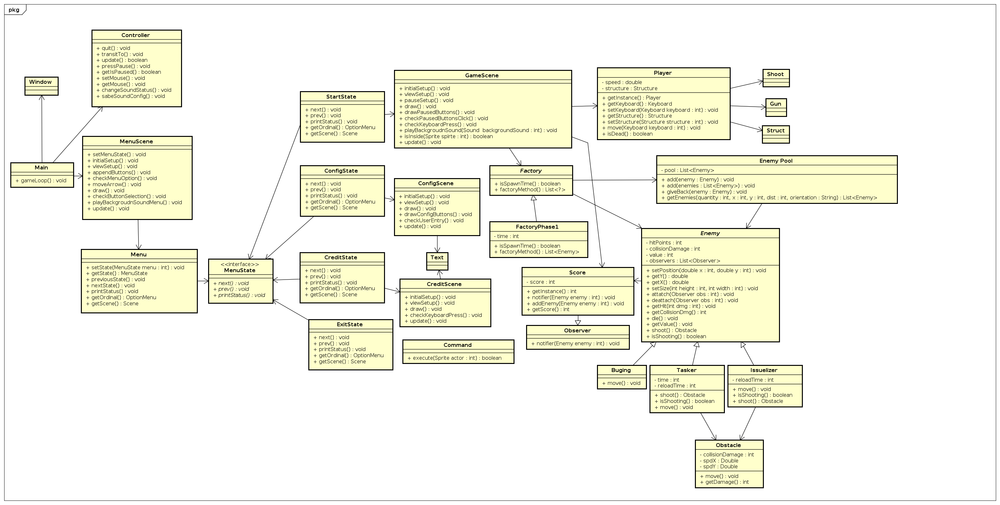

|Versão|Autor|Descrição|
|------|-----|---------|
|1.0|João Vítor|Adição do diagrama de classes da JPlay|
|2.0|João Lucas|Adição dos diagramas de classes do projeto|
|2.1|João Vítor|Correção do diagrama de classes da JPlay e adição de nova versão do diagrama de classes do projeto|
|3.0|Filipe Toyoshima|Atualização do Diagrama de Classes|

# Diagramas de Classes
 
 Um diagrama de classes é uma representação da estrutura e relações das classes que servem de modelo para objetos. Ou seja é um conjunto de objetos com as mesmas características, assim saberemos identificar objetos e agrupá-los, de forma a encontrar suas respectivas classes. 
 
 Na Unified Modeling Language (UML) em diagrama de classe, uma classe é representada por um retângulo com três divisões, são elas: O nome da classe, seus atributos e por fim os métodos.

 
## Principal

Adotamos uma postura incremental ao desenvolver nosso diagrama de classes. Listando os termos importantes foi possível entender as relações existentes entre eles.

Também desenvolvemos uma diagrama referente ao JPlay para entender como ele se relaciona com o nosso diagrama para facilitar a implementação do projeto.

### Versão 0.1
Versão inicial onde buscamos listar as classes existentes.

### Versão 0.2
Nesta versão é possível perceber as primeiras relações entre as classes.

### Versão 0.3
Aqui tivemos a primeira influência do diagrama de classes do JPlay.

### Versão 1.0
Versão apresentada na dinâmica.

### Versão 2.0
Visão de alto nível de implementação.

### Versão 3.0
Visão detalhada da implementação.

### Versão 4.0
Visão final de acordo com a entrega na disciplina

## JPlay

### Versão 1.0
Versão incorreta do diagrama.

### Versão 2.0
Versão correta do diagrama.

