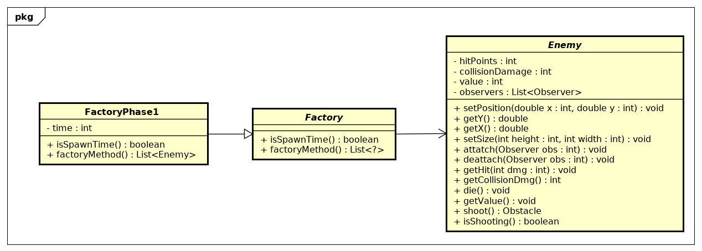

|Versão|Autor|Descrição|
|------|-----|---------|
|1.0|Lucas Hiroshi|Criador|

## Criador

Delegar a responsabilidade de criação de objetos é um dos mais comuns dentro da orientação de objetos. Nele basicamente uma classe B tem a responsabilidade de criar instâncias de uma classe A.

Durante o desenvolvimento do projeto optamos por utilizar Factory para a criação dos inimigos que é um padrão GOF e também um GRASP.

```java
public abstract class Factory {

	public Factory() {}
	
	public abstract boolean isSpawnTime();
	public abstract void sendBack(Enemy enemy);
	public abstract List <Enemy> factoryMethod();
}
```

```java
public abstract class Enemy extends Sprite{
	protected int hitPoints;
	protected int value;
	protected int colisionDamage;
	protected int health;
	
	private static String sprite = "";
	private List<Observer> observers = new ArrayList<Observer>();
	private static final Score s = Score.getInstance();
	
	protected Enemy(String sprite, int size, float x, float y, int health) {
		super(sprite, size);
		this.x = x;
		this.y = y;
		this.health = health;
		this.attach(s);
	}
}
```

