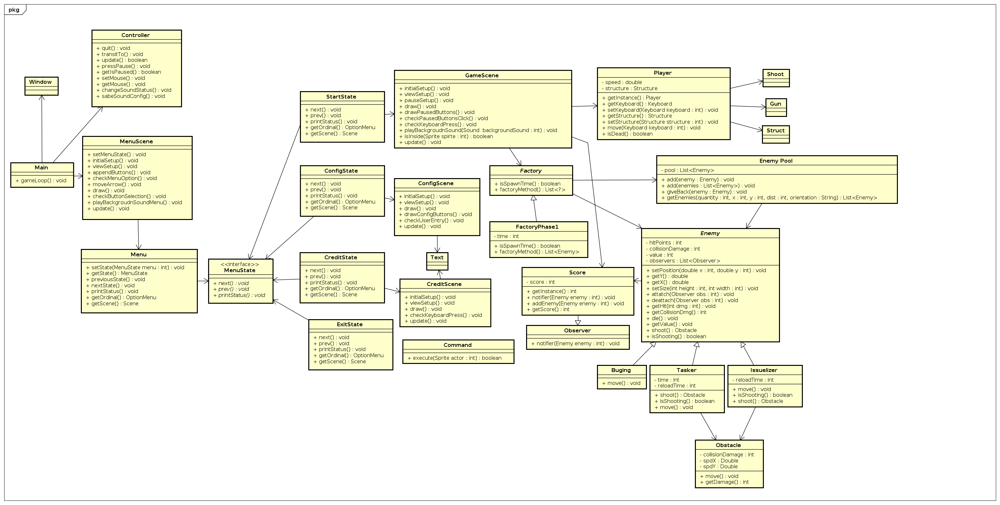
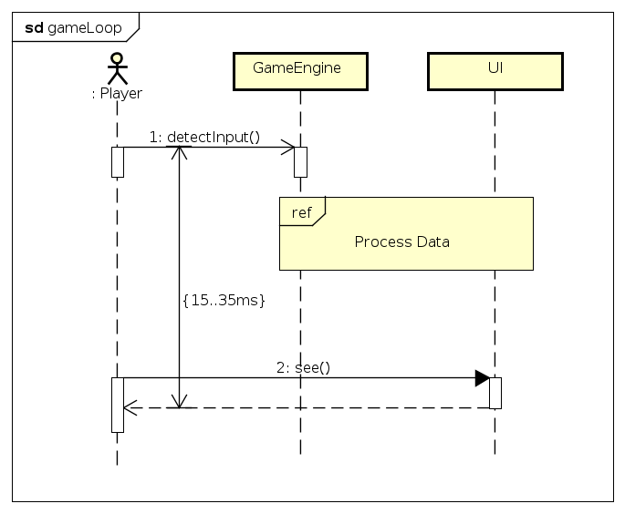
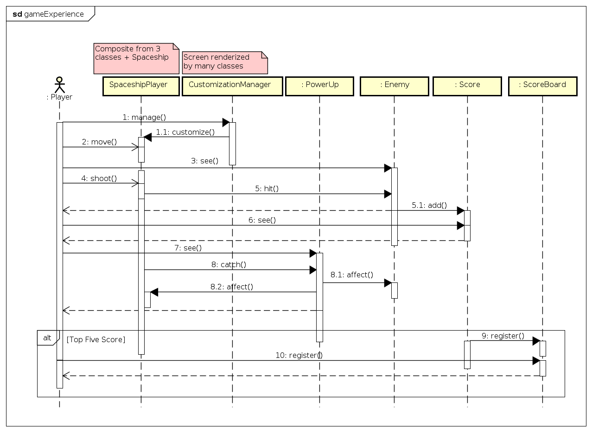

# Documento de Arquitetura de Software

## 1. Introdução

### 1.1 Objetivo
Este documento foi feito com o objetivo de descrever a arquitetura do jogo desenvolvido durante a disciplina de Arquitetura e Desenho de Software ministrado pela professora Milene Serrano como parte do curso de graduação do curso de engenharia de software da Universidade de Brasília.

Ele tem como objetivo mostrar as principais decisões tomadas para o desenvolvimento do jogo referentes a sua arquitetura mostrando diferentes visões de arquitetura para mostrar aspectos diferentes do sistema.

### 1.2 Escopo

Este Documento de Arquitetura de Software fornece uma visão geral de arquitetura do Force Gama Attack sendo desenvolvido pelo OctaBit. As decisões para a arquitetura foram influenciadas pelo GDD (Game Design Document)e pelo documento baseado no Principio de Pareto.

### 1.3 Definições, Acrônimos e Abreviações

GDD - Game Design Document
- O GDD (ou Game Design Document) é um documento contendo todas as informações relevantes do design de um jogo: temática, mecânicas, plataformas, inimigos, levels, entre outros.

### 1.4 Referências
Scott Rogers, Level Up the Guide to Great Game Design, 2010. John Wiley & Sons.

### 1.5 Visão Geral
O documento é divido em seções sendo a 2 a representação da arquitetura, a 3 o objetivos e restrições da arquitetura, 4 a visualização de casos de uso, 5 a visualização lógica, 6 a visualização do processo, 7 a de implementação, 8 tamanho e desempenho e a seção 9 a qualidade.

## 2. Representação da Arquitetura
Este documento apresenta a arquitetura como uma série de visualizações; visualização caso de uso visualização lógica, visualização do processo e visualização da implementação. Elas são visualizações em um modelo UML (linguagem de modelagem unificada).

## 3. Objetivos e Restrições da Arquitetura
Nesta seção é descrito os requisitos e os objetivos que possuem impacto no desenvolvimento do jogo sendo eles:

- O jogo deve ser desenvolvido em Java

- Ele deve ser desenvolvido antes do término da disciplina

- Os requisitos de desempenho devem ser seguidos

- Deve ser funcional em Windows e Linux

- O jogo deve utilizar a biblioteca JPlay como base

- O GDD deve ser seguido

## 4. Visualização de Casos de Uso

### 4.1 Visão Geral
Nesta seção é listado os casos de uso que representam uma funcionalidade central ou significante do sistema.

O diagrama de Casos de Uso auxilia no levantamento dos requisitos funcionais do sistema, descrevendo um conjunto de funcionalidades do sistema e suas interações com elementos externos e entre si.

### 4.2 UC01 - Menu Principal

#### 4.2.1 Diagrama V.1.0

### 4.3 UC02 - Jogar

#### 4.3.1 Diagrama

#### 4.3.2 Especificação

|  |  |
|  ------: | :------ |
|  **Descrição** | Tem como objetivo permitir ao usuário interagir com as mecânicas do jogo. |
| **Atores** | Usuário |
| **Pré Condições** | O sistema deve estar em pleno funcionamento. |
| **Fluxo Principal** | **FP01 - Começar o jogo** 1. Abre a tela inicial do jogo. 2. Usuário seleciona a opção start. 3. A cena de jogo se inicia. 4. Caso de uso encerrado.[FA01][FA02][FA03][FA04] **FP02 - Escolher nome do jogador** 1. Abre a tela inicial do jogo. 2. Usuário seleciona a opção de escolher nome. 3. Usuário confirma nome escolhido 4. A cena de jogo se inicia. 5. Caso de uso encerrado.[FA01][FA02][FA03][FA04] |
| **Fluxos Alternativos** | **FA01 - Abrir Menu de Pausa** 1. Usuário clica no botão de pausa presente na tela de jogo. 2. Jogo pausa. 3. Jogo mostra opções do menu de pausa. 4. Usuário retorna para o quarto passo do fluxo principal.[FA05][FA06][FA07] **FA02 - Atirar** 1. Usuário clica no botão de tiro. 2. Bala é instanciada na cena. 3. Animação de tiro é iniciada. 4. Usuário retorna para o quarto passo do fluxo principal.[FA08] **FA03 - Movimentar a nave** 1. Usuário clica no botão de moviemento. 2. Animação de movimento é iniciada. 3. A nave muda de lugar. 4. Usuário retorna para o quarto passo do fluxo principal.[FA09][FA10] **FA04 - Silenciar o jogo** 1. Usuário clica no botão de mutar o som. 2. Som é desativado no jogo. 3. Usuário retorna para o quarto passo do fluxo principal. **FA05 - Reiniciar fase** 1. Usuário clica na opção de reiniciar a fase. 2. Fase é reiniciada. **FA06 - Voltar ao jogo** 1. Usuário clica na opção de voltar ao jogo. 2. Menu de pausa sai da tela. 3. Jogo sai da pausa. 4. Retorna ao passo quatro do fluxo principal. **FA07 - Voltar ao menu principal** 1. Usuário clica na opção de voltar ao menu principal. 2. Jogo sai da tela de jogo. 3. Jogo carrega a tela de menu **FA08 - Destruir inimigos** 1. Bala entra em contato com inimigo. 2. Animação de destruição se inicia. 3. Som de destruição se inicia. 4. Instância do inimigo é destruída. 5. Retorna ao passo quatro do fluxo principal **FA09 - Coletar moedas** 1. Moeda é instanciada na cena. 2. Nave entra em contato com moeda. 3. Som de coleta de moeda se inicia. 4. Animação de coleta de moeda se inicia. 5. Instância da moeda é destruída. 6. Número de moedas coletadas aumenta. 7. Retorna ao passo quatro do fluxo principal **FA10 - Coletar power up** 1. Power up é instanciado na cena. 2. Nave entra em contato com power up. 3. Som de coleta de power up se inicia. 4. Animação de coleta de power up se inicia. 5. Instância do power up é destruída. 6. Os atributos da nave mudam de acordo com o power up coletado. 7. Retorna ao passo quatro do fluxo principal **FA11 - Silenciar Música de Fundo** 1. Usuário clica na opção de silenciar a música. 2. A música de fundo deixa de ser tocada. 3. Usuário deve retornar ao passo seis do fluxo alternativo para jogar o jogo sem música.  |
| **Fluxos de Exceção** | Não se aplica. |
| **Pós Condições** | Usuário terá acesso a tela de jogo e opções do jogabilidade. |

### 4.4 UC03 - Customização

#### 4.4.1 Diagrama

#### 4.4.2 Especificação

|  |  |
|  ------: | :------ |
|  **Descrição** | Tem como objetivo permitir ao usuário customizar a nave que utiliza no jogo. |
| **Atores** | Usuário |
| **Pré Condições** | O sistema deve estar em pleno funcionamento. |
| **Fluxo Principal** | **FP01 - Começar o jogo** 1. Abre a tela inicial do jogo. 2. Usuário seleciona a opção customizar nave. 3. A cena de customização carrega. 4. Caso de uso encerrado.[FA01][FA02][FA03][FA04] |
| **Fluxos Alternativos** | **FA01 - Customizar propulsores/estruturas** 1. Usuário clica na opção de customizar propulsores/estruturas. 2. Tela de customização de propulsores/estruturas carrega. 3. Jogo mostra opções de customização. 4. O usuário escolhe a opção de customização 5. Usuário retorna para o quarto passo do fluxo principal.[FA05][FA06][FA07] **FA02 - Customizar armas** 1. Usuário clica na opção de customizar armas. 2. Tela de customização de armas carrega. 3. Jogo mostra opções de customização. 4. O usuário escolhe a opção de customização 5. Usuário retorna para o quarto passo do fluxo principal.[FA05][FA06][FA07] **FA03 - Customizar escudo** 1. Usuário clica na opção de customizar escudo. 2. Tela de customização de escudo carrega. 3. Jogo mostra opções de customização. 4. O usuário escolhe a opção de customização 5. Usuário retorna para o quarto passo do fluxo principal.[FA05][FA06][FA07] **FA04 - Customizar especial** 1. Usuário clica na opção de customizar especial. 2. Tela de customização de especial carrega. 3. Jogo mostra opções de customização. 4. O usuário escolhe a opção de customização 5. Usuário retorna para o quarto passo do fluxo principal.[FA08][FA09][FA10] **FA05 - Opção C** 1. Usuário clica na opção de customizar com a opção C. 2. Nave é modificada de acordo com a opção selecionada. 3. Usuário retorna para o fluxo anterior. **FA06 - Opção Python** 1. Usuário clica na opção de customizar com a opção Python. 2. Nave é modificada de acordo com a opção selecionada. 3. Usuário retorna para o fluxo anterior. **FA07 - Opção Java** 1. Usuário clica na opção de customizar com a opção Java. 2. Nave é modificada de acordo com a opção selecionada. 3. Usuário retorna para o fluxo anterior. **FA08 - Opção Django** 1. Usuário clica na opção de customizar com a opção Django. 2. Nave é modificada de acordo com a opção selecionada. 3. Usuário retorna para o fluxo anterior. **FA09 - Opção Vaadin** 1. Usuário clica na opção de customizar com a opção Vaadin. 2. Nave é modificada de acordo com a opção selecionada. 3. Usuário retorna para o fluxo anterior. **FA10 - Opção C++** 1. Usuário clica na opção de customizar com a opção C++. 2. Nave é modificada de acordo com a opção selecionada. 3. Usuário retorna para o fluxo anterior. |
| **Fluxos de Exceção** | Não se aplica. |
| **Pós Condições** | Nave do jogador customizada de acordo com as especificações. |

### 4.5 UC04 - Configurações

#### 4.5.1 Diagrama

#### 4.5.2 Especificação

|  |  |
|  ------: | :------ |
|  **Descrição** | Tem como objetivo permitir ao usuário editar as configurações do jogo. |
| **Atores** | Usuário |
| **Pré Condições** | O sistema deve estar em pleno funcionamento. |
| **Fluxo Principal** | **FP01 -Abrir as configurações** 1. Abre a tela inicial do jogo. 2. Usuário seleciona a opção configurações. 3. As configurações são listadas na tela. 4. Caso de uso encerrado.[FA01][FA02] |
| **Fluxos Alternativos** | **FA01 - Silenciar o jogo** 1. Usuário clica na opção de silenciar o jogo. 2. O jogo ficará silenciado até que o usuário desative essa opção. **FA02 - Escolher nome do jogador** 1. Usuário clica na opção de mudar/escolher o nome do jogador. 2. Aparecerá um campo onde o usuário poderá inserir o nome do jogador. 3. Usuário insere o nome do jogador. 4. Usuário clica no botão de salvar salvar. 5. Caso de uso encerrado. |
| **Fluxos de Exceção** | Não se aplica. |
| **Pós Condições** | Usuário terá configurado o jogo de acordo com a sua vontade. |

## 5. Visualização Lógica

### 5.1 Visão Geral
Nesta seção é descrito as partes significantes da arquitetura como a decomposição em pacotes, componentes e classes do jogo.

Nesta seção temos uma descrição da visualização lógica da arquitetura. Na qual as classes mais importantes, suas organizações nos pacotes de serviço e subsistemas é descrita, assim como a sua organização desses subsistemas em camadas.

### 5.2 Modelo de Domínio
Um modelo de domínio é a representação visual de classes conceituais ou objetos do mundo real em um domínio.

### 5.3 Diagrama de Classe

Um diagrama de classes é uma representação da estrutura e relações das classes que servem de modelo para objetos. Ou seja é um conjunto de objetos com as mesmas características, assim saberemos identificar objetos e agrupá-los, de forma a encontrar suas respectivas classes.

Na Unified Modeling Language (UML) em diagrama de classe, uma classe é representada por um retângulo com três divisões, são elas: O nome da classe, seus atributos e por fim os métodos.

Adotamos uma postura incremental ao desenvolver nosso diagrama de classes. Listando os termos importantes foi possível entender as relações existentes entre eles.

Também desenvolvemos uma diagrama referente ao JPlay para entender como ele se relaciona com o nosso diagrama para facilitar a implementação do projeto.

#### 5.3.1 Versão 0.1
Versão inicial onde buscamos listar as classes existentes.

#### 5.3.2 Versão 0.2
Nesta versão é possível perceber as primeiras relações entre as classes.

#### 5.3.3 Versão 0.3
Aqui tivemos a primeira influência do diagrama de classes do JPlay.

#### 5.3.4 Versão Final

### 5.3.5 JPlay Versão 1.0

### 5.3.6 JPlay Versão 2.0
Nessa nova versão do diagrama foi corrigido o erro da inversão das setas na generalização.

### 5.4 Diagrama de Pacotes
Um pacote é um conjunto de elementos agrupados. O diagrama fornece uma visão conceitual no geral um mesmo pacote contém o mesmo tipo de item.

#### 5.4.1 Versão 0.1

#### 5.4.2 Versão 0.2

#### 5.4.3 Versão 1.0

#### 5.4.4 Versão 1.1

### 5.5 Diagrama de Componentes
Ele representa um modelamento físico dos componentes de software de um
determinado Sistema no qual um componente realiza um conjunto de interfaces e contém em seu
interior classes e interfaces, esse componente pode conter em seu projeto um ou mais padrões de projeto.

Um componente pode possuir dependências de outros componentes a solução de software pode conter componentes próprios ou de terceiros no caso do jogo o JPlay.

#### 5.5.1 Versão 0.1

#### 5.5.2 Versão 1.0

## 6. Visualização do Processo

### 6.1 Visão Geral
A visão de processo descreve a estrutura de processo de sistemas. Nós processos apenas os processos que forem arquiteturalmente importante serão descritos. 

### 6.2 Diagrama de Sequência

O diagrama de sequência tem por objetivo exibir ciclos de vida dentro da execução de determinada parte de um programa de software e a maneira e sequência com a qual interagem. Tem uma noção de linearidade vertical, no sentido de que as interações que ocorrem antes estão acima das que ocorrem depois.

Os ciclos de vida podem ser Classes, atores ou até mesmo abstrações que ocorrem entrem as classes.

#### 6.2.1 O Game Loop

Este diagrama tem por finalidade resumir todo o trabalho da Game Engine, delimitando assim o tempo de execução máximo para cada loop. Esse tempo foi definido com base no que a comunidade de jogadores defende sobre o mínimo de taxa de atualização para que se tenha noção de fluidez. Este mínimo constatado foi de 30Hz a 60Hz, o que, convertendo para o tempo de cada atualização, gera um máximo de aproximadamente 35ms.

Além disso, esse diagrama nos conta um pouco sobre como a arquitetura do jogo vai funcionar, mostrando que o input gerado pelo jogador é interpretado pela Game Engine que, através de uma série de mecanismos aqui omitidos, comunicará com a Interface do Usuário, para que então este possa ter feedback sobre o que está acontecendo no jogo.

#### 6.2.2 Experiência do Jogo

Esse diagrama resume as interações do jogador para com cada parte do jogo. Note que alguns dos ciclos de vida são classes, enquanto outros são abstrações explicadas por notas, logo acima do nome.

Inicia-se com o ato e customizar sua nave. Só então ele poderá usá-la em jogo, tendo como primeira ação a de movimentação. Assim que ele vir um inimigo, ou seja, um objeto da classe :Enemy, o jogador deverá então atirar. O tiro pode ou não acertar o inimigo. Quando um inimigo morre, ele irá então adicionar uma pontuação no objeto :Score, além de oferecer um feedback para o jogador.

Além dos inimigos, o jogador pode também interagir com objetos da classe PowerUp, que poderá ter efeitos sobre o Enemy, sobre a nave do jogador ou até mesmo sobre a maneira como é renderizada a tela, a depender do tipo de PowerUp com o qual o jogador está interagindo.

Ao final do jogo, seja por vitória ou derrota, há um fluxo condicional, onde a condição é o :Score ter um valor que supere pelo menos o quinto maior registrado do :ScoreBoard. Caso isso ocorra, o jogador então registrará seu nome no :ScoreBoard e obterá feedback sobre o sucesso da operação.

### 6.3 Diagrama de Colaboração

#### Versão 0.1
##### Diagrama MenuGame

##### Diagrama Sprite

#### Versão 1.0
##### Diagrama MenuGame

##### Diagrama Sprite

#### Versão 1.1
#### Diagrama MenuGame

#### Diagrama Sprite

### 6.4 Diagrama de Atividades

#### Diagrama de Level
##### Versão 1.1

#### Diagrama de Colisões

##### Versão 1.0

### 6.5 Diagrama de Estados
#### Versão 0.1

#### Versão 1.0

## 7. Visualização de Implementação

### 7.1 Visão Geral
Nesta seção tem como objetivo realizar um mapeamento do software na infraestrutura disponível normalmente os sistemas são distribuídos e contém vários componentes também espalhados ao longo da infraestrutura.

O diagrama contém Nós e eventualmente os componentes em cada Nó as ligações entre nós representam as ligações de rede com portas e parâmetros necessários

O objetivo deste diagrama é facilitar e documentar a implantação de um sistema de software

### 7.2 Diagrama
#### Versão 0.1

### 7.2.1 Camada 1
#### Personal Computer
A primeira camada é representada pelo computador pessoal que será utilizado para rodar o jogo. Qualquer computador que atenda os requisitos mínimos defnidos na seção 8.2 poderá ser utilizado.

### 7.2.2 Camada 2
#### JRE
A segunda camada é representada pela JRE (Java Runtime Environment) que é o ambiente de execução utilizado para executar as aplicações java.

### 7.2.3 Camada 3
#### JVM
A terceira camada é representada pela JVM (Java Virtual Machine) que é a responsável por carregar e executar os aplicativos java, convertendo os bytecodes em código executável de máquina.

## 8. Tamanho e Desempenho
### 8.1 Visão Geral
Aqui é descrito os objetivos de desempenho assim como o dimensionamento das características do jogo que impactam na arquitetura.

### 8.2 Requisitos Mínimos
- Processador: 2Ghz.
- Memória RAM: 1 GB.
- Memória de Vídeo: 128 MB.
- Direct3D: Sim.
- Versão do DirectX: 9.0c.
- Sistemas Operacionais: Windows 7, Windows 10, Ubuntu 16, Debian 7, Arch
- Espaço: 60 MB livres em disco.

### 8.3 Tempo de Resposta
O tempo de resposta para o input de ações dentro do jogo foi decidido baseado no tempo que o monitor leva para mudar de uma cor para outra. Normalmente, isso é medido em termos de passar de preto para branco para preto novamente, em termos de milissegundos. Um tempo de resposta típico do LCD é inferior a dez milissegundos (10 ms) sendo esse o tempo definido.

## 9. Qualidade

### 8.1 Visão Geral
