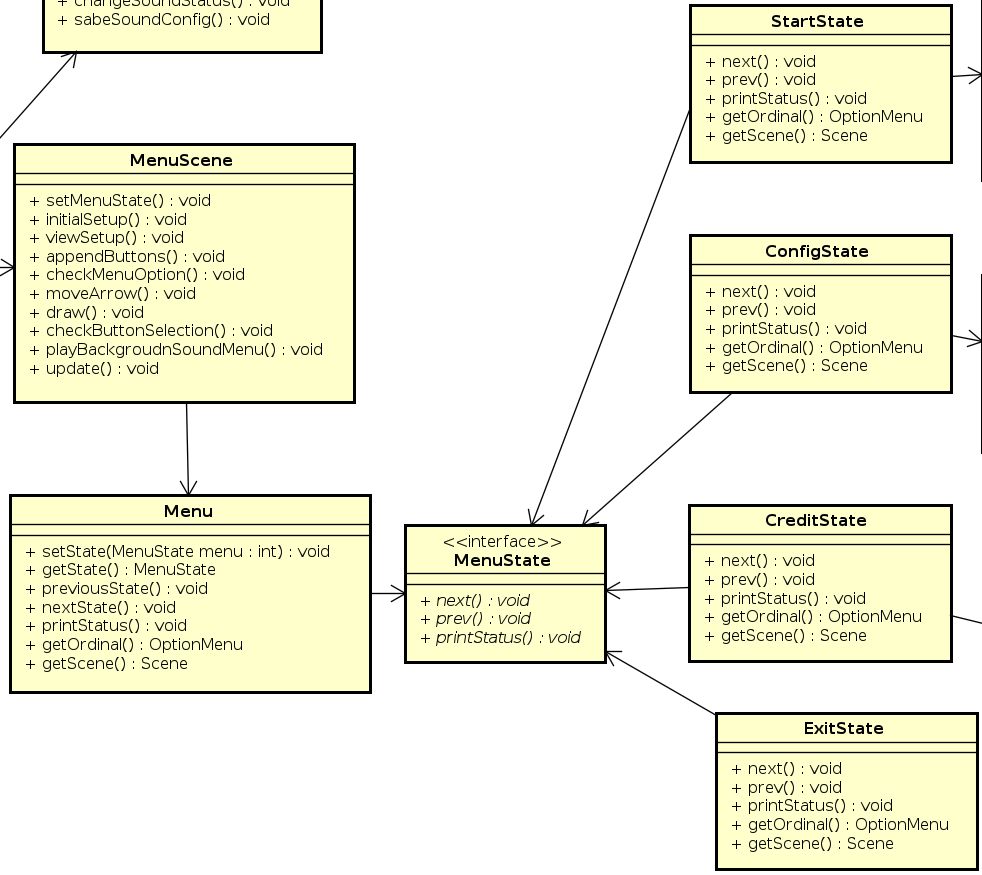
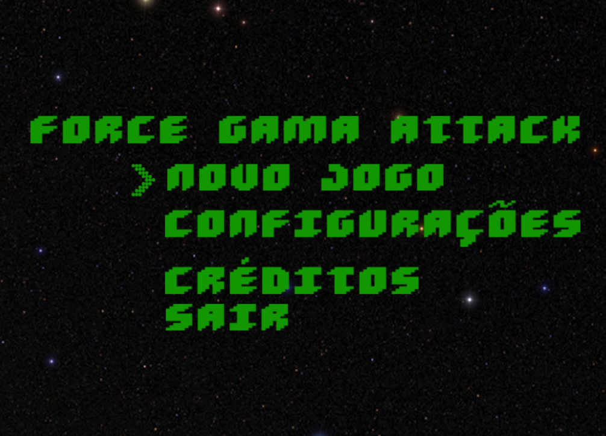

|Versão|Autor|Descrição|
|------|-----|---------|
|1.0|Lucas Vitor|State|

## Menu: State

Para implementação dos menus que respondiam às teclas up_key, down_key, right_key ou left_key.

O **State** foi escolhido pois cada alteração na opção do menu faz com que seu comportamento seja alterado, logo o presente padrão se mostra como uma excelente opção. Esta decisão permitiu uma melhor organização do código, aumento na manutenibilidade e maior facilidade ao evoluir o software no tocante aos menus (facilidades estas expressas diversas vezes pela própria equipe em diversos momentos).

Abaixo temos a representação (recorte) do diagrama de um dos states imiplementados no projeto e a tela do jogo onde se pode encontrar a implementação do padrão:

