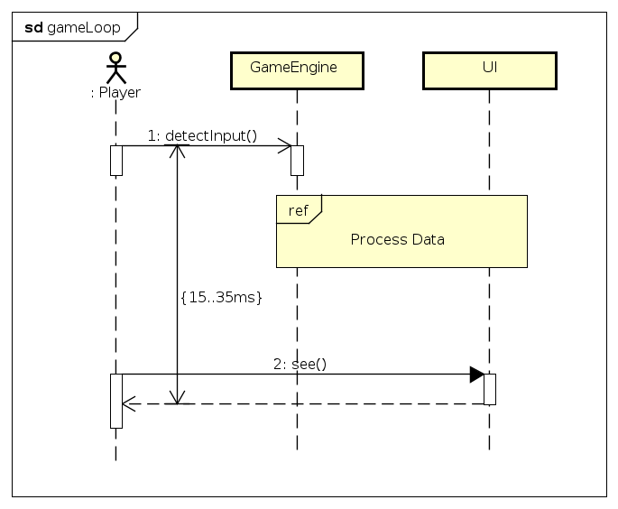
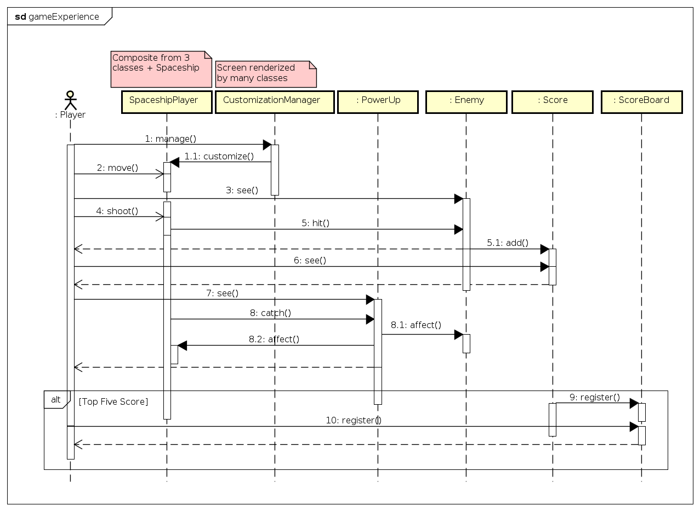

|Versão|Autor|Descrição|
|------|-----|---------|
|1.0|Filipe Toyoshima, Lucas Hiroshi|Documento Inicial|

# Diagrama de Sequência

O diagrama de sequência tem por objetivo exibir ciclos de vida dentro da execução de determinada parte de um programa de software e a maneira e sequência com a qual interagem. Tem uma noção de linearidade vertical, no sentido de que as interações que ocorrem antes estão acima das que ocorrem depois.

Os ciclos de vida podem ser Classes, atores ou até mesmo abstrações que ocorrem entrem as classes.

## O Game Loop

Este diagrama tem por finalidade resumir todo o trabalho da Game Engine, delimitando assim o tempo de execução máximo para cada loop. Esse tempo foi definido com base no que a comunidade de jogadores defende sobre o mínimo de taxa de atualização para que se tenha noção de fluidez. Este mínimo constatado foi de 30Hz a 60Hz, o que, convertendo para o tempo de cada atualização, gera um máximo de aproximadamente 35ms.

Além disso, esse diagrama nos conta um pouco sobre como a arquitetura do jogo vai funcionar, mostrando que o input gerado pelo jogador é interpretado pela Game Engine que, através de uma série de mecanismos aqui omitidos, comunicará com a Interface do Usuário, para que então este possa ter feedback sobre o que está acontecendo no jogo.

## Experiência do Jogo

Esse diagrama resume as interações do jogador para com cada parte do jogo. Note que alguns dos ciclos de vida são classes, enquanto outros são abstrações explicadas por notas, logo acima do nome.

Inicia-se com o ato e customizar sua nave. Só então ele poderá usá-la em jogo, tendo como primeira ação a de movimentação. Assim que ele vir um inimigo, ou seja, um objeto da classe :Enemy, o jogador deverá então atirar. O tiro pode ou não acertar o inimigo. Quando um inimigo morre, ele irá então adicionar uma pontuação no objeto :Score, além de oferecer um feedback para o jogador.

Além dos inimigos, o jogador pode também interagir com objetos da classe PowerUp, que poderá ter efeitos sobre o Enemy, sobre a nave do jogador ou até mesmo sobre a maneira como é renderizada a tela, a depender do tipo de PowerUp com o qual o jogador está interagindo.

Ao final do jogo, seja por vitória ou derrota, há um fluxo condicional, onde a condição é o :Score ter um valor que supere pelo menos o quinto maior registrado do :ScoreBoard. Caso isso ocorra, o jogador então registrará seu nome no :ScoreBoard e obterá feedback sobre o sucesso da operação.