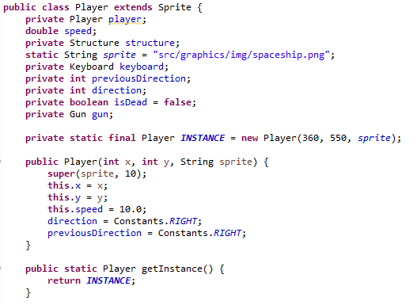

|Versão|Autor|Descrição|
|------|-----|---------|
|1.0|João Lucas|Singleton da Nave do Player|

## Player Spaceship: Singleton

Para implementação da nave do player foi implementado o padrão GOFs **Singleton**.

De acordo com Erich Gamma, o singleton visa garantir que uma classe tenha somente uma instância e fornece um ponto global de acesso para a mesma.

O **Singleton** foi escolhida para que a nave do jogador tenha apenas uma INSTANCE da sprite e que essa instância seja apenas usada para a nave.

### Referências

* GAMMA, Erich et al. Padrões de Projeto: Soluções reutilizáveis de software orientado a objetos.

* BRIZENO, Marcos. Padrões de Projeto. Disponível em: <https://brizeno.wordpress.com/padroes/>. Acesso em 30 jun 2019.
