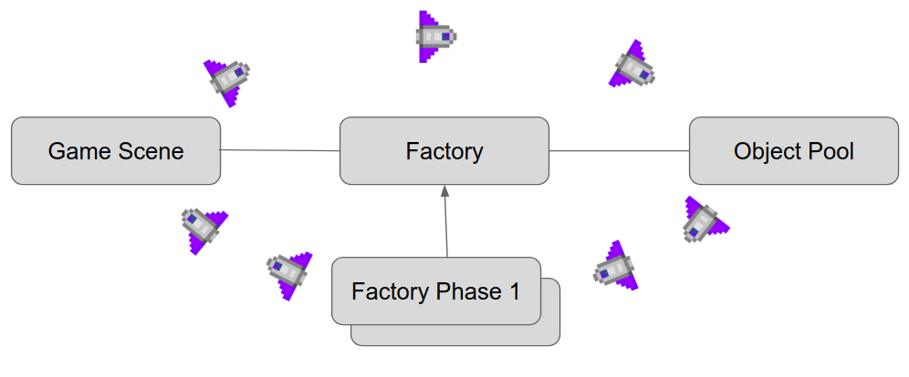

|Versão|Autor|Descrição|
|------|-----|---------|
|1.0|Filipe Toyoshima|Fabric + Object Pool|

# GoFs Aplicados

Segue uma lista de padrões de projetos aplicados na implementação do Force Gama Attack

## Enemy: Factory + Object Pool

Para implementação dos inimigos que aparecem durate o jogo, foi implementado um híbrido entre os padrões Factory e Object Pool.

A **Factory** foi escolhida em razão da possibilidade de haver diferentes lógicas de instanciação de inimigos possíveis. Em fases iniciais do jogo, inimigos mais fáceis e em menor quantidade devem aparecer. Em fases mais posteriores, é necessário instanciar mais inimigos mais difíceis.

A **Object Pool** foi escolhida em razão do grande número de instanciações e exclusões que objetos do mesmo tipo podem ter. Desse modo, pode ser caro instanciar vários objetos de modo contínuo, e é mais inteligente apenas instanciar todos os necessários e apenas utilizá-los ao longo da execução do jogo.

Para juntar os dois padrões, a **Game Scene** (classe onde ocorre o Game Loop) instancia uma fábrica que contém a lógica desejada. Cada fábrica é construída de modo a criar várias Pools, uma para cada tipo de inimigo que poderá ser usado na fase. Assim que as Pools são criadas, elas são também populadas com o número de inimigos necessários para a execução de toda a fase. Ao longo do jogo, a Game Scene vai escutar a Fabric, que deverá periodicamente enviar inimigos da Pool. Se um inimigo morrer ou sair da tela, ele deve retornar à Pool. Então, a Game Scene chama um método da Fábrica, passando o inimigo que deve retornar como parâmetro. Esse método devolve o inimigo para a Pool, que deverá resetar seus atributos para que ele possa ser usado novamente depois.

