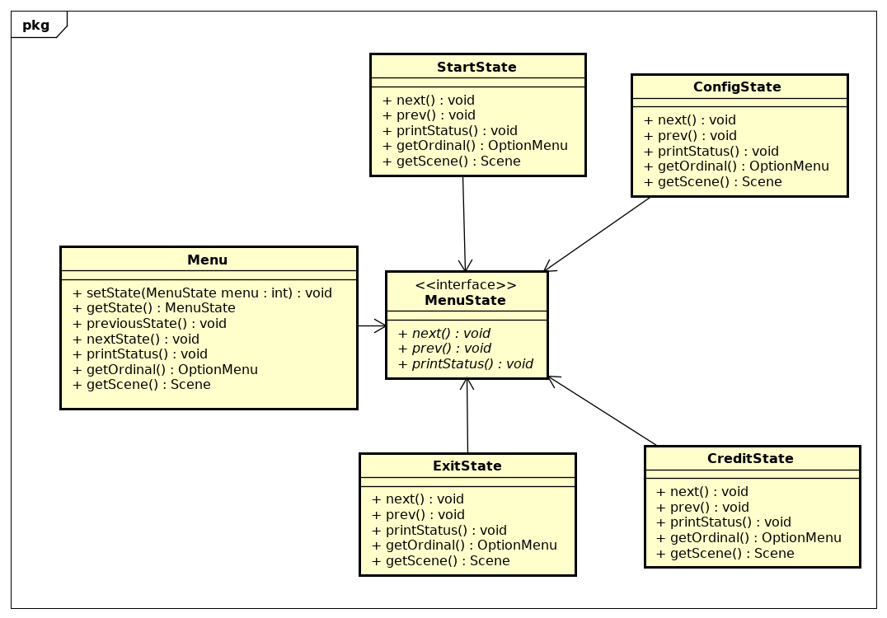

|Versão|Autor|Descrição|
|------|-----|---------|
|1.0|Lucas Hiroshi|Criação do documento|

## Variações Protegidas

O padrão variações protegidas protege elementos das variações em outros elementos envolvendo o foco de instabilidade com uma interface e usando polimorfismo para criar várias implementações desta interface.

Para a criação foi definido que seria utilizado um State que e uma interface que seria utilizado pelo classe Menu e pelos outros estados.

```Java
public interface MenuState {
	void next(Menu menu);
    void prev(Menu menu);
    void printStatus();
    OptionMenu getOrdinal();
    Scene getScene();
}

```

